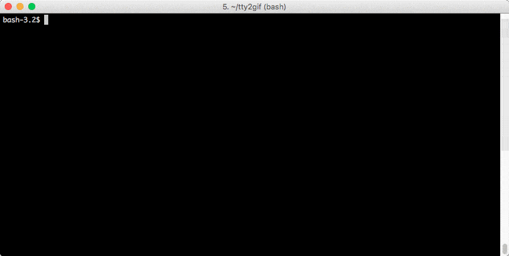

[](https://travis-ci.org/internap/fake-switches)
[](http://badge.fury.io/py/fake-switches)

Fake-switches
=============



Fake-switches is a pluggable switch/router command-line simulator. It is meant
to help running integrated tests against network equipment without the burden
of having devices in a lab. This helps testing the communication with the
equipment along with all of its layers for more robust high level tests.  Since
it is meant to be used by other systems and not humans, error handling on
incomplete commands and fail-proofing has been mostly left out and only
relevant errors are shown. 

The library can easily be extended to react to some changes in the fake switch
configuration and control an actual set of tools to have an environment
behaving like a real one driven by a switch.  For example, you could hook
yourself to the VLAN creation and use vconfig to create an actual vlan on a
machine for some network testing.

This library is NOT supported by any vendor, it was built by
reverse-engineering network equipment.


Actual supported commands
=========================

Command support has been added in a as-needed manner for the purpose of what
was tested and how.  So see which commands may be used and their supported
behavior, please see the tests section for each model.

| Model   | Protocols        | Test location |
| ------- | ---------------- | ------------- |
| Cisco   | ssh and telnet   | [tests/cisco/test_cisco_switch_protocol.py](tests/cisco/test_cisco_switch_protocol.py) |             
| Brocade | ssh              | [tests/brocade/test_brocade_switch_protocol.py](tests/brocade/test_brocade_switch_protocol.py) |
| Juniper | netconf over ssh | [tests/juniper/juniper_base_protocol_test.py](tests/juniper/juniper_base_protocol_test.py) |
| Dell    | ssh and telnet   | [tests/dell/](tests/dell/) |

Using it with Docker
====================

```shell
$ docker run -P -d internap/fake-switches
$ docker ps
CONTAINER ID        IMAGE                             COMMAND                  CREATED             STATUS              PORTS                     NAMES
6eec86849561        internap/fake-switches            "/bin/sh -c 'fake-swi"   35 seconds ago      Up 13 seconds       0.0.0.0:32776->22/tcp     boring_thompson
$ ssh 127.0.0.1 -p 32776 -l root
root@127.0.0.1's password:  # root
my_switch>enable
Password:  # press <RETURN>
my_switch#show run
Building configuration...

Current configuration : 164 bytes
version 12.1
!
hostname my_switch
!
!
vlan 1
!
interface FastEthernet0/1
!
interface FastEthernet0/2
!
interface FastEthernet0/3
!
interface FastEthernet0/4
!
end

my_switch#

```

Launching with custom parameters
--------------------------------

```shell
$ docker run -P -d -e SWITCH_MODEL="another_model" internap/fake-switches
```

Supported parameters
--------------------

- SWITCH_MODEL, defaults to _cisco_generic_
- SWITCH_HOSTNAME, defaults to _switch_
- SWITCH_USER, defaults to _root_
- SWITCH_PASS, defaults to _root_
- LISTEN_HOST, defaults to _0.0.0.0_
- LISTEN_PORT, defaults to _22_


Building image from source
--------------------------

```shell
$ docker build -t fake-switches .
$ docker run -P -d fake-switches
```

Extending functionality
=======================

The SwitchConfiguration class can be extended and given an object factory with
custom classes that can act upon resources changes. For example :

```python

from twisted.internet import reactor
from fake_switches.switch_configuration import SwitchConfiguration, Port
from fake_switches.ssh_service import SwitchSshService
from fake_switches.cisco.cisco_core import CiscoSwitchCore

class MySwitchConfiguration(SwitchConfiguration):
    def __init__(self, *args, **kwargs):
        super(MySwitchConfiguration, self).__init__(objects_overrides={"Port": MyPort}, *args, **kwargs)


class MyPort(Port):
    def __init__(self, name):
        self._access_vlan = None

        super(MyPort, self).__init__(name)

    @property
    def access_vlan(self):
        return self._access_vlan

    @access_vlan.setter
    def access_vlan(self, value):
        if self._access_vlan != value:
            self._access_vlan = value
            print "This could add vlan to eth0"


if __name__ == '__main__':
    ssh_service = SwitchSshService(
        ip="127.0.0.1",
        ssh_port=11001,
        switch_core=CiscoSwitchCore(MySwitchConfiguration("127.0.0.1", "my_switch", ports=[MyPort("FastEthernet0/1")])))
    ssh_service.hook_to_reactor(reactor)
    reactor.run()
```

Then, if you connect to the switch and do

```
    ssh root@127.0.0.1 -p 11001
    password : root
    > enable
    password:
    # configure terminal
    # vlan 1000
    # interface FastEthernet0/1
    # switchport access vlan 1000
```

Your program should say "This could add vlan to eth0" or do anything you would
want it to do :)


Starting a switch from the command line
=======================================

```shell
    pip install fake-switches
    
    fake-switches

    # On a different shell, type the following:
    ssh root@127.0.0.1 -p 22222
```

Command line help
-----------------

The --help flag is supported.

    fake-switches --help
    usage: fake-switches [-h] [--model MODEL] [--hostname HOSTNAME]
                         [--username USERNAME] [--password PASSWORD]
                         [--listen-host LISTEN_HOST] [--listen-port LISTEN_PORT]

    Fake-switch simulator launcher

    optional arguments:
      -h, --help            show this help message and exit
      --model MODEL         Switch model, allowed values are
                            juniper_qfx_copper_generic, cisco_2960_24TT_L,
                            dell_generic, dell10g_generic, juniper_generic,
                            cisco_2960_48TT_L, cisco_generic, brocade_generic
                            (default: cisco_generic)
      --hostname HOSTNAME   Switch hostname (default: switch)
      --username USERNAME   Switch username (default: root)
      --password PASSWORD   Switch password (default: root)
      --listen-host LISTEN_HOST
                            Listen host (default: 0.0.0.0)
      --listen-port LISTEN_PORT
                            Listen port (default: 2222)


Available switch models
-----------------------

At time of writing this document, the following models are available:
 
  * brocade_generic
  * cisco_generic
  * cisco_2960_24TT_L
  * cisco_2960_48TT_L
  * dell_generic
  * dell10g_generic
  * juniper_generic
  * juniper_qfx_copper_generic

Use the --help flag to find the available models.

The generic models are mainly for test purposes. They usually have less ports than a proper switch
model but behave the same otherwise. Once a "core" is available, more specific models can be very
easily added. Send your pull requests :)


Contributing
============

Feel free raise issues and send some pull request,
we'll be happy to look at them!
